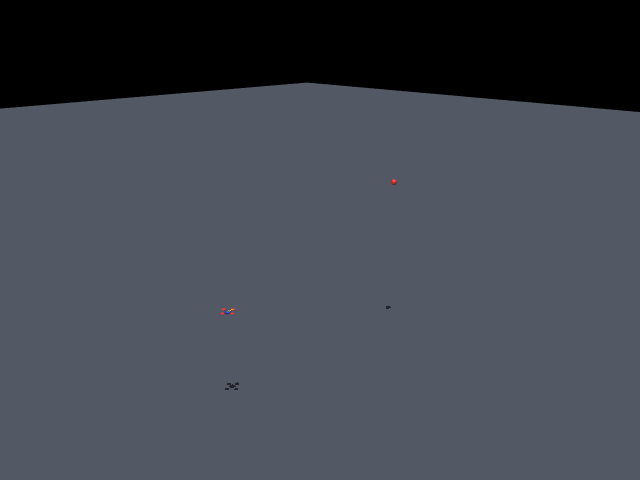

# Autonomous Quadcopter Drone Interceptor

A deterministic, classically-architected guidance, navigation and control stack for
counter-UAS interception, simulated in MuJoCo.

A 1 kg quadcopter must detect, track and physically collide with a second — possibly
evasive — flying target, using only range-and-angle measurements that are noisy, biased,
sampled at a finite rate and delivered late. Every stage is explicit mathematics rather
than a learned model: deep reinforcement learning was evaluated at design-review stage and
deliberately rejected in favour of **determinism**, **valid physics** and
**explainability**.

**New here? Read [`docs/START_HERE.pdf`](docs/START_HERE.pdf) first** — a five-page
orientation covering what this is, how it works, and how to run it.



---

## Results at a glance

Measured on the canonical batch: `--trials 100 --seed 0`.

| KPI | Target | Measured | |
| :--- | :--- | :--- | :---: |
| Mission success rate | ≥ 90% | **95%** (95/100) | ✅ |
| Max target speed intercepted | ≥ 83.6 km/h | **89.7 km/h** | ✅ |
| Miss distance `R_miss` | ≤ 1.05 m | 95% of trials; median hit **0.024 m** | ✅ |
| Z-axis overshoot | ≤ 0.5 m | 98% compliance; median **0.002 m** | ✅ |
| Time-to-intercept | static < 10 s, moving < 20 s | 95% compliance | ✅ |
| Command saturation | ≤ 5% of flight time | 77% compliance; median 1.3% | ⚠️ |

11/11 baseline scenarios pass every KPI; 11/11 stress probes intercept. The saturation row
is a real, characterised tail failure on sub-two-second high-speed engagements — reported
rather than tuned away. See [`docs/RESULTS.md`](docs/RESULTS.md).

## Quick start

Requires **Python 3.11+**, ~1 GB disk, **CPU only** — no GPU, no CUDA, no separate MuJoCo
install (the pip wheel bundles its native libraries). A display is needed only for the
replay viewer.

```bash
python -m venv .venv
source .venv/bin/activate          # Windows: .\.venv\Scripts\Activate.ps1
pip install -e ".[dev]"

python scripts/check_env.py                                   # environment doctor
python scripts/run_intercept.py --target 8 3 6 --seconds 9    # first interception, ~5 s
```

Expected output:

```text
Ran 2048 steps headlessly against target [8.0, 3.0, 6.0].
  min miss distance: 0.037 m at t=5.12 s  [HIT vs R_miss <= 1.05 m]
  run log:  results/intercept/run_log.csv
  snapshot: results/intercept/run_config.json
```

Lines beginning `command saturation:` are **not errors** — they are the limiter honestly
reporting that guidance asked for more acceleration than the airframe can produce.
Measuring that is a graded KPI.

## Command reference

| Command | What it does | Time |
| :--- | :--- | ---: |
| `scripts/check_env.py` | Checks Python, imports, MuJoCo, GL backend; renders one off-screen frame | ~2 s |
| `scripts/run_intercept.py --target X Y Z` | One engagement against a hovering target | ~5 s |
| `scripts/run_scenarios.py scenarios/ --report --results-dir results/scenarios` | 11 static & linear geometries + KPI table + plots | ~21 s |
| `scripts/run_scenarios.py scenarios/stress --results-dir results/stress` | 11 stress probes: evasive weaves, 84–90 km/h ramps, wind | ~14 s |
| `scripts/run_montecarlo.py --trials 100 --seed 0 --report --results-dir results/montecarlo` | The headline number: 100 randomized 3D trials | ~1 min 50 s |
| `scripts/replay.py results/<run_dir>` | Replay a recorded run in 3D (needs a display) | — |
| `pytest` | 221 headless, seeded tests | ~80 s |
| `ruff check src tests scripts` | Lint | — |

`run_intercept.py` flags: `--start X Y Z` (default `0 0 2`), `--seed N`, `--seconds S`
(upper bound; the run stops at closest approach), `--no-terminate`, `--run-id NAME`,
`--params FILE.yaml`.

`run_scenarios.py` accepts a single `.yaml` file or a directory, and reads that directory
**without recursing** — which is why the baseline and stress suites are two separate
commands.

## Watching a run

`results/` is generated output and is **git-ignored** — a fresh clone contains no runs, so
there is nothing to replay until you have flown something. Generate first, then replay.

```bash
# 1. generate a run — any of these
python scripts/run_intercept.py --target 8 3 6 --seconds 9
#   -> results/intercept/
python scripts/run_scenarios.py scenarios/stress --results-dir results/stress
#   -> results/stress/<scenario>/
python scripts/run_montecarlo.py --trials 10 --seed 0 --report --results-dir results/montecarlo
#   -> results/montecarlo/trial_XXXX/

# 2. replay any run directory you just created
python scripts/replay.py results/intercept                    # top isometric view
python scripts/replay.py results/stress/sinusoidal_3d_spiral --view interceptor
python scripts/replay.py results/montecarlo/trial_0007 --speed 0.5 --loop
```

Point the viewer at a **leaf** run directory — one holding `run_log.csv` — not at a suite
root such as `results/stress`, which contains only the per-scenario folders. The viewer
re-renders the recorded log rather than re-simulating, so it reads no live ground truth and
cannot change any result; that is why it is the one deliberately interactive tool in an
otherwise headless project. Interceptor trail is cyan, target trail orange/yellow.

## How it works

Six stages, each consuming only the published output of its immediate predecessor:

```text
[1 Simulation] ──SensorMeasurement (noisy, delayed)──►
[2 Estimation] ──TargetEstimate (relative state + covariance)──►
[3 Guidance]   ──AccelerationCommand (ideal)──►
[4 Limiter]    ──LimitedAcceleration (physically safe)──►
[5a Outer ctl] ──AttitudeReference (roll/pitch/yaw + thrust)──►
[5b Inner ctl] ──BodyWrench (torques + thrust)──►
[6 Mixer]      ──MotorCommand (4 × rotor RPM)──► back into [1]
```

| Stage | What it does |
| :--- | :--- |
| 1 — Simulation | MuJoCo physics, rotor model, noisy delayed sensor, target trajectories, wind |
| 2 — Estimation | A 9-state Extended Kalman Filter recovering latency-compensated relative motion |
| 3 — Guidance | The Optimal Guidance Law: a lag-aware Zero-Effort-Miss law that *leads* the target |
| 4 — Limiter | The only place acceleration is clamped — and the only place saturation is measured |
| 5 — Flight control | 50 Hz outer loop (acceleration → tilt + thrust) and 400 Hz inner attitude loop |
| 6 — Mixer | Thrust and torques → four rotor speeds, clamped to real motor limits |

Three rules make the output trustworthy:

- **No stage may reach around its input.** Guidance cannot read raw sensor data; nothing
  outside `simulation/` may read ground truth. A stage that reaches around its input is a
  defect, not a shortcut.
- **Fail loud, never silent.** A NaN in any message, EKF divergence, an unknown scenario
  key, or a guidance law other than `OGL` raises immediately rather than propagating.
- **One seeded RNG factory.** Identical seed + identical config ⇒ byte-identical run log.
  Every run writes `run_config.json` (seed, resolved params, git hash); every batch writes
  `batch_manifest.json` (master seed), so `(master_seed, num_trials)` regenerates it
  exactly. Enforced by
  `tests/integration/test_montecarlo_batch.py::test_batch_is_reproducible`.

## Repository layout

```text
├── docs/            Design review, START_HERE, PROJECT_EXPLAINED, standards, results
├── models/          MuJoCo world: scene.xml, quadcopter.xml, target.xml
├── scenarios/       11 baseline YAML + ablation/ + stress/ (11 probes)
├── scripts/         check_env, run_intercept, run_scenarios, run_montecarlo, replay
├── src/interceptor/
│   ├── config/      constants.py (physical) + params.py (tunable)
│   ├── common/      types, frames, rng, logging, guards
│   ├── simulation/  [1] plant, actuators, sensors, trajectories, wind, rendering
│   ├── estimation/  [2] ekf
│   ├── guidance/    [3] ogl, zem, time_to_go
│   ├── control/   [4,5] command_limiter, outer_loop, inner_loop, motor_mixer
│   ├── pipeline/    [6] orchestrator, scheduler
│   └── analysis/    [5] kpis, scenarios, montecarlo, reporting
├── tests/           unit/ + integration/ — headless, seeded (221 tests)
└── results/         Generated logs, snapshots, reports (git-ignored)
```

## Writing your own scenario

Drop a YAML file anywhere and point the runner at it.

```yaml
name: my_scenario
seed: 0
target_class: moving        # "static" | "moving" — selects the time KPI bound
guidance_law: OGL           # OGL is the sole law; anything else is rejected
time_limit_s: 20.0
wind_preset: moderate       # optional: calm | moderate | gusty
interceptor:
  start_m: [0.0, 0.0, 2.0]
target:
  type: linear              # static | linear | sinusoidal | varying_speed
  start_position_m: [9.0, -5.0, 5.0]
  velocity_m_s: [0.0, 2.0, 0.0]
```

```bash
python scripts/run_scenarios.py my_scenario.yaml
```

Per-type target keys:

| `type` | Required keys |
| :--- | :--- |
| `static` | `position_m` |
| `linear` | `start_position_m`, `velocity_m_s` |
| `sinusoidal` | `start_position_m`, `drift_velocity_m_s`, `amplitude_m`, `frequency_hz` |
| `varying_speed` | `start_position_m`, `heading`, `initial_speed_m_s`, `peak_speed_m_s`, `ramp_duration_s` |

An optional `params:` block deep-merges onto the defaults, so any tunable (sensor noise,
EKF, guidance, limiter, PID) can be overridden for one scenario without touching code. The
loader fails loud on unknown keys, missing keys, a bad vector shape, a non-`OGL` law, or
setting both `wind_preset` and an explicit `params.wind` block.

## Known limitations

- **L1 — Command saturation on sub-2-second high-speed intercepts.** 23% of randomized
  trials exceed the 5%-of-flight-time budget, in a narrow regime: an 85+ km/h crossing
  target engaged from rest and closed in ~2 s. It still hits, but spends much of that
  short flight pinned at the tilt cap. Closing it needs adaptive command authority or
  launch-shaping — a logic change, out of scope for params-only tuning.
- **L2 — Fast off-axis targets are the physical degradation edge.** The `varying_speed`
  family carries 4 of the batch's 5 misses. A from-rest interceptor cannot always lead a
  strongly crossing target above ~85 km/h — geometry, not a defect. The candidate fix
  (augmented ZEM) is implemented but **gated off**: with a relative-state EKF it would feed
  the interceptor's own manoeuvre back as positive feedback.
- **L3 — Far-static engagements are tight against the 10 s static budget.** Static targets
  beyond ~12 m are intercepted, but the time metric can slip.

## Troubleshooting

| Symptom | Cause / fix |
| :--- | :--- |
| `gladLoadGL error`, off-screen render fails | No GL context. `export MUJOCO_GL=egl` (headless GPU) or `osmesa` (software), or skip with `pytest -m "not mujoco"`. No simulation result depends on rendering. |
| Replay viewer does nothing / crashes on a server | It needs a real display. Use the CSV logs and generated plots instead. |
| Replay complains about a missing log | The run has not been generated yet, or the path is a suite root rather than a leaf run directory. |
| `ModuleNotFoundError: interceptor` | The editable install did not take. Re-run `pip install -e ".[dev]"` with the venv activated. |
| `pip` cannot resolve the pinned versions | Python is probably older than 3.11. Check `python --version`. |
| A scenario errors out immediately | Intentional: the loader fails loud and the message names the offending section. |
| Runs feel slow | Single-process CPU physics: ~2 s per scenario, ~1 s per Monte-Carlo trial. Reduce `--trials`. |

## Documentation

| Document | Answers |
| :--- | :--- |
| [`docs/START_HERE.pdf`](docs/START_HERE.pdf) | Where to begin: overview, how to run, how to replay |
| [`docs/Autonomous_Drone_Interceptor_Project_Report.pdf`](docs/Autonomous_Drone_Interceptor_Project_Report.pdf) | The full narrative: rationale, architecture, methodology, results, limitations |
| [`docs/Autonomous_Drone_Interceptor_Design_Review.md`](docs/Autonomous_Drone_Interceptor_Design_Review.md) | Why this architecture and this guidance law |
| [`docs/PROJECT_EXPLAINED.md`](docs/PROJECT_EXPLAINED.md) | How every stage works, from scratch, with a glossary |
| [`docs/ENGINEERING_STANDARDS.md`](docs/ENGINEERING_STANDARDS.md) | The rules the code is built to |
| [`docs/RESULTS.md`](docs/RESULTS.md) | Measured KPIs, breakdowns, known limits, reproduction commands |
| [`docs/GETTING_STARTED.md`](docs/GETTING_STARTED.md) | Step-by-step install, first run and troubleshooting |
